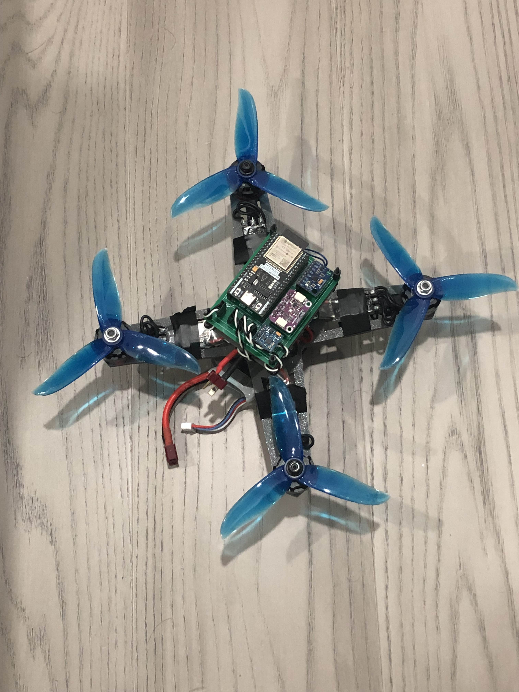
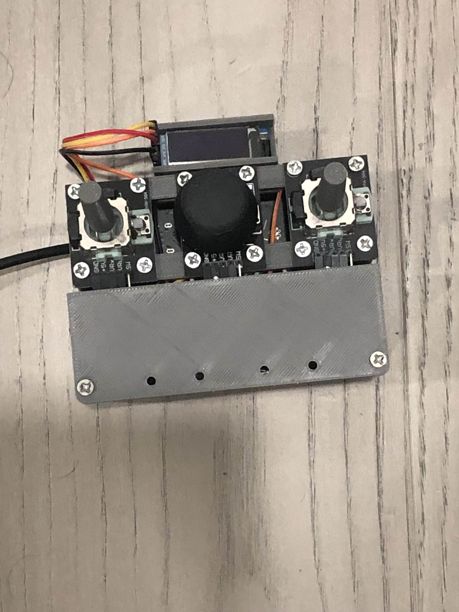

# ESP32 Quadcopter Flight Controller

A work-in-progress **quadcopter flight controller** using an **ESP32**, with IMU, barometer, and magnetometer integration. Controller and quadcopter communicate using the **ESP-NOW protocol**. Using PID control loops to achieve stable flight. 

---

## Features
- 4-motor control with RS2205 2300 kV motors and LittleBee 30A ESCs  
- Wireless communication via **ESP-NOW** between custom controller and quadcopter  
- Custom 3D printed quadcopter frame and controller

---

## Components Used
| Component | Description |
|-----------|-------------|
| RS2205 2300 kV | Brushless motors (x4) |
| LittleBee 30A ESC | Electronic speed controllers (x4) |
| MPU6050 | Gyroscope + accelerometer |
| BMP390 | Barometer for altitude |
| QMC5883 | Magnetometer for heading |
| ESP32 | Flight controller and controller board |
